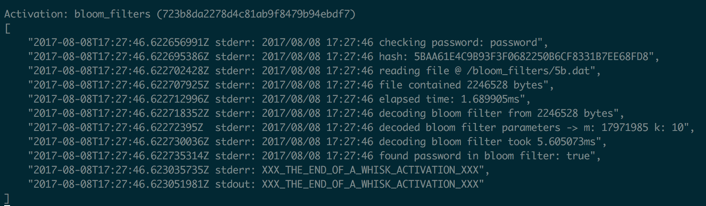

# Serverless Pwned Passwords

Serverless Pwned Passwords uses serverless functions to provide an API for checking potential passwords against an [enormous corpus of passwords](https://haveibeenpwned.com/Passwords) leaked from security breaches.

[Bloom filters](https://en.wikipedia.org/wiki/Bloom_filter) generated from the corpus of leaked passwords are used to test for membership. [Go functions](http://jamesthom.as/blog/2017/01/17/openwhisk-and-go/) running on [Apache OpenWhisk](http://openwhisk.incubator.apache.org/) expose an API to check passwords against the list.

💪 *Testing a potential password against 320 million leaked passwords takes milliseconds!* 💪



## usage 

*Need an instance of Apache OpenWhisk to use? Sign up for [IBM Bluemix](https://console.bluemix.net/registration) which comes with a [generous free tier](https://console.bluemix.net/openwhisk/learn/pricing).*

Having installed the action using instructions below, test the service using the [command-line](https://console.bluemix.net/docs/openwhisk/openwhisk_cli.html#cloud-functions-cli). 

*`bloom_filters` takes a single parameter (`password`) with the potential password. `found` is returned as true if password test was positive.*

Let's check the most commonly used password of all time…. `password`!

```
$ wsk action invoke bloom_filters --result --param password password
{
    "found": true
}	
```

Unsurprisingly, this was found in the leaked password corpus.

What about something else? 

```
$ wsk action invoke bloom_filters --result --param password serverless
{
    "found": false
}
```

Great, `serverless` was not found and I can keep using it… 😉

### web actions

Exposing our service as a "[web action](https://github.com/apache/incubator-openwhisk/blob/master/docs/webactions.md)" provides a public API endpoint for our serverless function.

```
$ wsk action update bloom_filters --web true
ok: updated action bloom_filters
$ wsk action get bloom_filters --url
ok: got action bloom_filters
https://openwhisk.host/api/v1/web/user@email/default/bloom_filters
```

Allowing us to call it using a normal HTTP request.

```
$ http get https://openwhisk.host/api/v1/web/user@email/default/bloom_filters.json?password=password
{
    "found": true
}
```

### performance

Looking at the logging output shows performance data for each password check.

```
$  wsk activation logs 2818b2657a7043918cf4495b7b6083ff
2017-08-15T15:17:18.833465399Z stderr: checking password: password
2017-08-15T15:17:18.833497727Z stderr: hash: 5BAA61E4C9B93F3F0682250B6CF8331B7EE68FD8
2017-08-15T15:17:18.83350474Z  stderr: reading file @ /bloom_filters/5b.dat
2017-08-15T15:17:18.833509954Z stderr: file contained 2246528 bytes
2017-08-15T15:17:18.83351495Z  stderr: elapsed time: 1.780073ms
2017-08-15T15:17:18.833519804Z stderr: decoding bloom filter from 2246528 bytes
2017-08-15T15:17:18.833524969Z stderr: decoded bloom filter parameters -> m: 17971985 k: 10
2017-08-15T15:17:18.833530802Z stderr: decoding bloom filter took 5.910131ms
2017-08-15T15:17:18.833535692Z stderr: found password in bloom filter: true
```


## installation

Follow the instructions below to create the bloom filters, build the runtime image and create the OpenWhisk action. 

*Building and publishing the action runtime image is an optional step. If you would rather skip this step, use this pre-existing Docker image: https://hub.docker.com/r/jamesthomas/bloom_filters/* 

### download pwned passwords (optional)

* Download all the password hash files listed at https://haveibeenpwned.com/Passwords
* Extract all files using the [7zip](http://www.7-zip.org/) compression tool.

*There is a [Homebrew Formula](http://brewformulas.org/P7zip) for installing the tool on OS X.*

### generate bloom filters (optional)

* Install Bloom Filter library 

  ```
  $ go get -u github.com/willf/bloom
  ```

* Run Bloom Filter generator program (`generate/generate_filters.go`) with hash file arguments.

  ```
  $ cd generate
  $ go run generate_filters.go pwned-passwords-1.0.txt pwned-passwords-update-1.txt pwned-passwords-update-2.txt 
  2017/08/14 17:43:09 Creating Bloom filters with parameters --> n: 17971985 k: 10
  2017/08/14 17:43:09 Initialising 256 bloom filters...
  2017/08/14 17:43:09 Bloom filter buckets: 256
  2017/08/14 17:43:09 Reading hashes from file:  pwned-passwords-update-1.txt
  2017/08/14 17:43:10 Processed 1000000 hashes...
  ...
  2017/08/14 17:43:19 Added XXX hashes to bloom filters
  2017/08/14 17:43:19 Serialising 256 bloom filters...
  2017/08/14 17:43:19 bucket: d1 encoded bytes: XXX
  ...
  ```

*Generated bloom filters will be serialised to files in the `bloom_filters` directory. Files use the bucket identifier as the file name (`00.dat -> ff.dat`).* 

### build runtime image (optional)

*Hosting images on Docker Hub requires registering a (free) account @ https://hub.docker.com/*

* Build the Docker image for the runtime.

  ```
  $ docker build -t <DOCKERHUB_USER>/bloom_filters .
  ```

* Push Docker image to Docker Hub.

  ```
  $ docker push <DOCKERHUB_USER>/bloom_filters 
  ```

### build openwhisk action

* Build Go binary for OpenWhisk runtime.

  ```
  $ env GOOS=linux GOARCH=amd64 go build -o exec bloom_filters.go
  ```

* Add binary to zip file.

  ```
  $ zip action.zip exec
  ```

### create openwhisk action

* Create OpenWhisk action using binary archive file and Docker image.

  ```
  $ wsk action create bloom_filters --docker <DOCKERHUB_USER>/bloom_filters action.zip
  ```


***Once the action has been created, use the instructions above for testing it out.***


## customising

Bloom filters use two parameters to control the probability of false positives, the size of the bit field (*m*) and the number of hashing functions (*k*). 

Given a desired false positive rate and the number of items to be stored, optimal values for these parameters [can be calculated](https://stackoverflow.com/questions/658439/how-many-hash-functions-does-my-bloom-filter-need). Bloom filter calculators exist online: https://hur.st/bloomfilter

**In this example, ~320 million passwords need to be checked with a false positive rate of 0.001%.** 

Optimal Bloom filter parameter values given these conditions are:

- *m:* 4,600,828,022 (548.46MB)
- *k:* 10

Instantiating a Bloom filter of this size would add unacceptable delays [during "cold" invocations](https://read.acloud.guru/does-coding-language-memory-or-package-size-affect-cold-starts-of-aws-lambda-a15e26d12c76). Splitting the password hashes into groups and generating Bloom filters for each group can be used to reduce the Bloom filter size. 

**Password hashes are split into 256 buckets using the first two hex characters from the string.** Each Bloom filter needs to match 1.25M password hashes rather than 320M. 

Bloom filter parameter values given these new conditions are:

- *m:* 17,971,985 (2.14MB).
- *k:* 10

Parameters for m and k are stored in the `generate.go` file.
